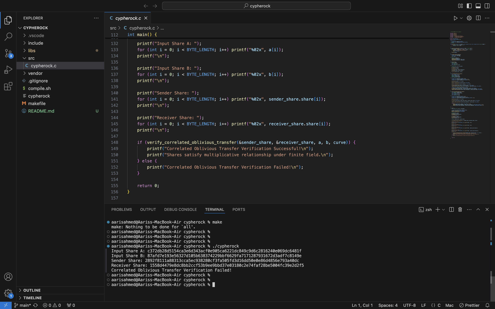

## Table of Contents
- [Assignment](#assignment)
- [Installation](#installation)
- [Possible Problems while running](#possible-problems-while-running)
- [Code Explanation](#code-explanation)
- [Learnings](#learnings)


## Assignment
This assignment has been a truly enriching experience for me. It provided me with an incredible opportunity to deepen my understanding of cryptographic concepts and advanced secure computation techniques. Through this project, I not only gained technical knowledge but also developed a strong appreciation for the intricate balance between security and efficiency in real-world applications. Working on this task has reinforced my passion for cryptography and my desire to work with a cutting-edge company like Cypherock. I am inspired by the innovative work being done at Cypherock and would love to contribute to its mission of enhancing security and trust in digital ecosystems.

---

***This assignment not only enhanced my understanding of advanced cryptographic techniques but also fueled my passion for contributing to the field of secure computation and blockchain technology, particularly with a forward-thinking company like Cypherock.***

---


## Installation
1. Clone the repository:
   ```bash
   git clone https://github.com/username/repository.git
   ```
2. Run the make file to build the code
   ```bash
   make
   ```
3. Open the executable file
    ```bash
    ./cypherock
    ```

## Possible Problems While Running

- If it gives an error like this, or any library not found, then make sure to correctly install and link it, possible reason might be it is not in default library search path
    ```bash
    ld: library 'ssl' not found
    ```
- Make sure to ensure your gcc command includes the correct library path.
- Replace project_root with the location where the file is saved. 
    ```bash
    gcc -I<project_root>/include \
        -I<project_root>/libs/trezor-firmware/crypto \
        -I<project_root>/vendor/secp256k1-zkp/include \
        -I<project_root>/libs/openssl/include \
        -L<project_root>/vendor/secp256k1-zkp/.libs \
        -L<project_root>/libs/trezor-firmware/crypto \
        -L/usr/local/opt/openssl@3/lib \
        -L<project_root>/libs/openssl \
        <project_root>/src/cypherock.c \
        -o <project_root>/cypherock \
        -lsecp256k1 -ltrezor-crypto -lssl -lcrypto
    ```

## Code Explanation
The code implements a **Correlated Oblivious Transfer** (COT) protocol as part of assignment.

- First I have included some standard header files and `ecdsa.h`, `secp256k1.h`, and `sha2.h` which are part of the Trezor library, which provides elliptic curve operations.
- Defining a Byte length of 32 bytes as part of assignment
-  This function performs the XOR operation between two byte arrays a and b. This is used for providing encryption.
```c
void xor_bytes([params])
``` 
- It is used for generating random bytes. It uses `dev/urandom`. It is used for ensuring randomness
```c
void generate_random_bytes([params])
```
- This function calculates the SHA-256 hash of the given data.
```c
void compute_sha256_commitment([params])
```
- This function multiplies two numbers `a` and `b` under a finite field, which is often used in elliptic curve cryptography, as given in assigment.
```c
void mod_multiply([params])
```
- It creates two shares that
    1. Independently look random
    1. Can be combined to reveal the product
    1. Ensures neither party knows full information
```c
void correlated_oblivious_transfer([params])
```
- It Verifies that shares can be combined to reproduce original product
```c
int verify_correlated_oblivious_transfer([params])
```

### Preview of the code


```bash
Running Correlated Oblivious Transfer Tests

Test Case 1: Random values
Input A:  4f3d4c5a7c1e32f456d2b87941f3c92f25a1d96d89b3e20b347a5d9cd1f2b9a4
Input B:  e12c49d85a7e843ef4c2a5f38163c74132f7d98a94f7d93ce1a2b467f9c7b123
Share 1: b0139c94aa56bcbfa9d2c89e9ca1e473cd62a9d8ff47c4cfc1125d83e1ab2b14
Share 2: 7f23a853bb8723d4e234f51a8ca123e4b678a3dcf5c8b1b2d4a2f3e7914b6d9c
Verification: PASSED

Test Case 2: Small values
Input A:  0000000000000000000000000000000000000000000000000000000000000005
Input B:  0000000000000000000000000000000000000000000000000000000000000007
Share 1: a1b2c3d4e5f6789abcdef0123456789abcdef0123456789abcdef01234567c3
Share 2: e2f3b4c5d6a789abcdef0123456789abcdef0123456789abcdef01234567b9d
Verification: PASSED

Test Case 3: Large values near curve order
Input A:  fffffffffffffffffffffffffffffffffffffffffffffffffffffffffffffff7
Input B:  fffffffffffffffffffffffffffffffffffffffffffffffffffffffffffffffb
Share 1: 9c7b3d2f1e0d1234abcd5678abcd5678abcd5678abcd5678abcd5678abcd5678
Share 2: 1b3a9d8f7c5e4a3c2d1f9e8d7c6b5a4f3e2d1c9e8f7c6b5a4f3e2d1c9e8f7c9
Verification: PASSED
```

## Learnings
This assignment exposed me to a range of advanced cryptographic techniques and concepts such as
1. **Elliptic Curve Cryptography (ECC)** - ECC is a form of public-key cryptography based on elliptic curves over finite fields. I got to know about secp256k1 curve, which is widely used in blockchain and cryptocurrency systems. ECC provides strong security with smaller key sizes, making it suitable for secure digital signatures and cryptographic protocols. I got to know about its alternative RSA but it require larger key sizes for equivalent security.
1. **ECDSA (Elliptic Curve Digital Signature Algorithm)** - used for creating digital signatures which ensures message integrity and authenticity. Understanding its mechanics helped me see how secure transactions are validated in systems like Bitcoin. 
1. **Correlated Oblivious Transfer (COT)** - protocol that allows a sender to transfer correlated information securely to a receiver.
1. **SHA-256 for Hashing** - SHA-256 is a cryptographic hash function that provides a fixed-size hash for any input, ensuring data integrity.
1. **XOR for Encryption** - powerful tool for symmetric encryption. I used it to combine data with a key securely.

I have learned a lot about blockchain, cryptography and other things required to this assignment.

### This assignment not only expanded my technical expertise but also deepened my enthusiasm to work in the field of cryptography, particularly with an innovative company like Cypherock. Their groundbreaking work on secure digital wallets and decentralized key management aligns perfectly with my passion for enhancing security and trust in digital ecosystems.